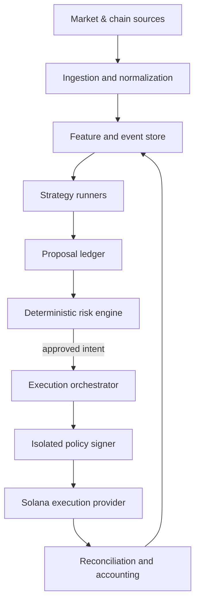

# Autonomous Trading Laboratory

## Engineering Specification and Safety Contract

**Status:** Design baseline / implementation source of truth  
**Version:** 1.0.0  
**Date:** 2026-09-19  
**Initial market:** Solana spot tokens  
**Initial settlement asset:** USDC  
**Initial execution adapter:** Jupiter (subject to an API spike before implementation)  
**Initial bankroll target:** $200 of research capital  

> This system is experimental software, not a promise of profit. A correct implementation can still lose the entire funded amount. No component may represent simulated or unrealized results as guaranteed returns.

---

## 1. Purpose

Build a controlled research platform that can discover, test, compare, combine, and retire crypto trading strategies. It must support a progression from historical research to paper trading and, only after explicit approval, very small live spot trades.

The product is not “a memecoin bot.” The product is a reproducible experiment system:

`idea → versioned strategy → backtest → forward paper test → tiny live test → evaluate → promote, revise, or retire`

Its lasting asset is the dataset: every signal, decision, rejection, attempted execution, fill, fee, exit, and result must be attributable to a strategy version and reproducible from stored inputs.

## 2. Goals

1. Run multiple independent strategies against the same normalized market data.
2. Test ensembles without allowing one strategy to bypass shared risk rules.
3. Compare backtest, paper, and live performance using cost-aware metrics.
4. Trade directly on-chain through supported execution adapters.
5. Keep signing authority isolated from research and AI components.
6. Enforce deterministic, fail-closed controls around every live transaction.
7. Preserve an immutable audit trail sufficient to explain every outcome.
8. Make providers replaceable so the research core is not tied to Fomo, Jupiter, one RPC vendor, or one model provider.

## 3. Non-goals for v1

- Leverage, margin, lending, borrowing, futures, options, or short selling.
- Cross-chain bridges or EVM execution.
- Browser automation or reverse-engineering private platform APIs.
- Copying a wallet without independent token and execution checks.
- Autonomous withdrawals or arbitrary token transfers.
- Custody of funds outside a dedicated, deliberately limited experiment wallet.
- High-frequency or latency-arbitrage trading.
- Automatic self-modification or promotion of strategy code.
- Claims that backtests, win rate, or AI confidence predict future profit.

## 4. Governing invariants

These are system requirements, not recommendations. Code conflicting with them is defective.

### 4.1 Authority boundaries

1. An LLM may research, summarize, rank, and propose. It may not sign, approve, or submit a transaction.
2. Only the deterministic risk engine can issue a short-lived execution authorization.
3. Only the isolated signer can use wallet key material.
4. The signer accepts a narrow, validated swap intent—not arbitrary serialized transactions supplied by a strategy or LLM.
5. No strategy process has signer credentials, database-administrator credentials, or live execution-provider credentials.
6. Live activation, risk-limit increases, withdrawal, and allowlist changes require a human owner action.
7. A rejected proposal cannot be retried with altered parameters under the same proposal ID.

### 4.2 Money and transaction safety

1. Spot swaps only; no leverage.
2. Live v1 uses USDC as the accounting/settlement asset, plus a separately reserved SOL fee balance.
3. Each proposal has an idempotency key; the same logical trade can execute at most once.
4. Every transaction must be simulated or validated through the provider's supported preflight path immediately before submission.
5. The expected input, minimum output, route programs, token mints, fees, price impact, expiry, and destination accounts must be checked before signing.
6. The destination token account must belong to the dedicated trading wallet.
7. The signer rejects instructions outside the explicit program allowlist and instruction-pattern policy.
8. Unknown Token-2022 extensions, transfer hooks, freeze conditions, or unsupported token behavior cause rejection.
9. A timeout or unavailable dependency is a rejection, never implicit approval.
10. The system must reconcile confirmed on-chain balances; application state is not the final authority.

### 4.3 Research integrity

1. Strategy source, configuration, feature schema, and model artifact are content-addressed and immutable after publication.
2. Any logic or parameter change creates a new strategy version.
3. Backtests use point-in-time inputs and account for fees, slippage, failed fills, latency, and liquidity constraints.
4. Training data may not leak future information into features.
5. Paper and live events are never mixed silently.
6. Deleted or failed experiments remain auditable.
7. Metrics are reported net of known execution costs.

## 5. Default experiment risk profile

All monetary values are configuration with audited owner changes. These defaults govern the initial $200 experiment.

| Control | Default | Behavior |
| --- | ---: | --- |
| Starting allocation | $185 USDC | Remaining funding is held as SOL fee reserve or unallocated buffer |
| Maximum new position | Lesser of $10 or 5% NAV | Checked using conservative price and current NAV |
| Maximum open positions | 5 | Pending entries count as open |
| Maximum gross exposure | 25% NAV | Unsettled transactions count toward exposure |
| Daily realized-loss limit | $20 | Trips live-entry circuit breaker until owner reset after UTC-day boundary |
| Intraday drawdown breaker | 10% NAV | Blocks entries; exits remain allowed |
| Maximum quote price impact | 1.0% | Stricter strategy limits may apply |
| Maximum total estimated cost | 2.0% of input | Includes price impact, route/platform fees, and priority/network fees |
| Maximum slippage tolerance | 1.0% | Never auto-expand after a failed trade |
| Minimum pool liquidity | $50,000 | Provisional; must be calibrated with reliable point-in-time data |
| Minimum token age | 24 hours | New-token experiments require a separate future profile |
| Maximum single-token exposure | 5% NAV | Across every strategy combined |
| Consecutive execution failures | 3 in 15 minutes | Global entry halt |
| Data freshness | 15 seconds for entry-critical fields | Stale data rejects entry |
| Live trading hours | Disabled by default | Owner-defined window required for activation |

Exit transactions may exceed entry limits when reducing risk, but they still require route, program, simulation, and destination validation. A loss breaker blocks new risk; it must not trap existing positions.

## 6. System modes and state machine

The entire deployment has one authoritative operating mode.

| Mode | Market data | Strategy evaluation | Simulated fills | Signing | Live submission |
| --- | --- | --- | --- | --- | --- |
| `OFFLINE_RESEARCH` | Recorded | Yes | Backtest | No | No |
| `SHADOW` | Live | Yes | No fills; proposals recorded | No | No |
| `PAPER` | Live | Yes | Cost-aware paper fills | No | No |
| `LIVE_ARMED` | Live | Yes | Optional parallel shadow | Available | Allowed after risk authorization |
| `HALTED` | Optional | Exits/monitoring only | Recorded | Exit policy only | New entries forbidden |

Allowed transitions:

- `OFFLINE_RESEARCH → SHADOW`: automated after test deployment.
- `SHADOW → PAPER`: owner action after data-quality acceptance.
- `PAPER → LIVE_ARMED`: owner action with a time-limited activation challenge and checklist.
- `LIVE_ARMED → HALTED`: automatic or owner action.
- `HALTED → LIVE_ARMED`: owner action only after the triggering incident is acknowledged.
- Any mode → `OFFLINE_RESEARCH`: owner action.

Restart behavior is fail-closed: a process restart never restores `LIVE_ARMED` automatically. Live permission expires on a configurable lease (initially 12 hours).

## 7. Logical architecture



The control plane manages strategy versions, experiments, risk profiles, modes, owner approvals, and dashboards. The data plane ingests observations, evaluates strategies, and processes trade workflows. The signer is a separate trust boundary.

## 8. Components

### 8.1 Ingestion service

Responsibilities:

- Consume Solana RPC/WebSocket data and approved third-party market/token feeds.
- Record raw provider payloads or stable content hashes with provider, timestamp, slot, and schema version.
- Normalize trades, quotes, pools, token metadata, wallet activity, balances, and transaction outcomes.
- Detect gaps, reordering, duplicates, stale streams, and provider disagreement.
- Backfill missed intervals without rewriting already published observations.

Requirements:

- Every event has `observed_at`, `source_time`, `slot` when available, `source`, and `ingestion_id`.
- Deduplicate by stable provider identity plus content hash.
- Entry-critical derived data states its maximum age and provenance.
- No strategy consumes an undocumented raw-provider object directly.

### 8.2 Feature service

Produces point-in-time features such as:

- Return/momentum over defined windows.
- Volume and liquidity level/acceleration.
- Expected price impact at the proposed order size.
- Holder concentration and changes.
- Wallet-cluster accumulation and wallet-quality signals.
- Token age, mint/freeze authority, program and extension flags.
- Market-regime features.

Every feature definition has a name, version, units, time window, data sources, null behavior, freshness limit, and tests proving it cannot read future observations.

### 8.3 Strategy runner

A strategy is a pure decision module. It receives a read-only snapshot and emits zero or more proposals. It cannot call the signer or execution provider.

```ts
type StrategyContext = {
  evaluationId: string;
  evaluatedAt: string;
  asOfSlot?: bigint;
  mode: "BACKTEST" | "SHADOW" | "PAPER" | "LIVE";
  portfolioSnapshotId: string;
  featureSnapshotId: string;
};

type TradeProposal = {
  proposalId: string;
  strategyVersionId: string;
  experimentId: string;
  side: "BUY" | "SELL";
  inputMint: string;
  outputMint: string;
  requestedInputAtomic: string;
  thesisCode: string;
  signalValues: Record<string, number | string | boolean | null>;
  confidence?: number; // descriptive only; never overrides policy
  validUntil: string;
};
```

Strategies may not emit wallet addresses, serialized transactions, program IDs, slippage overrides, or destination accounts.

### 8.4 Ensemble coordinator

The ensemble layer combines proposals, not money access. Supported initial policies:

- **Unanimous:** all named strategies agree.
- **Quorum:** at least `k` of `n` agree within a time window.
- **Weighted score:** versioned weights produce a thresholded score.
- **Veto:** mandatory safety/market-regime strategy can veto entry.

An ensemble is itself versioned and evaluated like a strategy. Correlated strategies do not count automatically as independent confirmation. Ensemble validation must compare net expectancy and drawdown against each constituent strategy on held-out data.

### 8.5 Deterministic risk engine

The risk engine evaluates proposals in a fixed, tested order:

1. Deployment mode and unexpired owner activation.
2. Proposal schema, freshness, identity, and strategy eligibility.
3. Duplicate/idempotency and pending-trade checks.
4. Wallet and accounting reconciliation status.
5. Global breakers and provider health.
6. Token and program policy.
7. Position, concentration, gross exposure, and bankroll limits.
8. Realized loss, drawdown, and failure limits.
9. Liquidity, route, price impact, slippage, and total-cost limits.
10. Transaction simulation/preflight result.

It returns an immutable `RiskDecision` containing every rule version, input value, threshold, and pass/fail result. Approval is bound to the exact proposal, quote hash, amount, expiry, wallet, network, and risk-profile version.

### 8.6 Execution orchestrator

Execution is a persisted state machine:

`PROPOSED → QUOTED → RISK_APPROVED → BUILT → VALIDATED → SIGNED → SUBMITTED → CONFIRMED → RECONCILED`

Terminal/exception states include `REJECTED`, `EXPIRED`, `SIMULATION_FAILED`, `SUBMISSION_FAILED`, `ONCHAIN_FAILED`, `UNKNOWN`, and `CANCELLED`.

Rules:

- Each transition uses compare-and-set persistence.
- Timeouts move to `UNKNOWN` until chain reconciliation proves the outcome.
- `UNKNOWN` never triggers an automatic duplicate trade.
- Quote expiry or material quote change requires a new risk decision.
- The final record stores expected versus actual input/output, all fees, price impact, slippage, signature, confirmation slot, and error details.

### 8.7 Execution-provider adapter

```ts
interface ExecutionProvider {
  getQuote(intent: ApprovedIntent): Promise<NormalizedQuote>;
  buildSwap(quote: NormalizedQuote): Promise<UnsignedSwap>;
  inspectSwap(unsigned: UnsignedSwap): Promise<InspectionResult>;
  simulate(unsigned: UnsignedSwap): Promise<SimulationResult>;
  submit(signed: SignedSwap): Promise<SubmissionResult>;
  confirm(signature: string): Promise<ConfirmationResult>;
}
```

Jupiter is the planned first adapter. Before implementation, complete a short API spike to select its then-current supported product and authentication/fee model. Provider-specific payloads remain inside the adapter. The core contract must not depend on a deprecated endpoint or on Jupiter-specific route fields.

### 8.8 Policy signer

The signer is a separate process or service with the smallest possible API surface.

It must:

- Keep secret key material out of source control, logs, prompts, databases, analytics, crash dumps, and client applications.
- Accept only an unexpired risk authorization plus inspected transaction.
- Re-derive and verify wallet-owned accounts and intended balance deltas.
- Parse every instruction and reject unknown programs/instruction shapes.
- Verify input/output mints, maximum input, minimum output, fee payer, blockhash age, allowed route programs, and destination ownership.
- Apply a nonce/idempotency record before returning a signature.
- Expose no general `signMessage`, arbitrary transfer, seed export, or raw-transaction signing endpoint.

For development, use generated devnet/test keys. Production key provisioning is a separate owner ceremony. The owner retains a securely backed-up recovery method; private keys are never pasted into chat or given to an LLM.

### 8.9 Portfolio and accounting service

- Reconcile wallet SOL/SPL balances and token accounts at startup, after every trade, and periodically.
- Use double-entry ledger records for USDC-equivalent cost basis, realized P&L, fees, and adjustments.
- Distinguish realized P&L, unrealized P&L, cash, fee reserve, open exposure, and NAV.
- Price illiquid/unsellable positions conservatively; a quoted mark is not proof of realizable value.
- Flag dust, unexpected airdrops, rebasing behavior, and unsolicited tokens. These never become eligible collateral or automatic sell targets.

### 8.10 Paper broker

Paper trading must not assume fills at the last price. It models:

- Decision-to-quote and quote-to-submit latency.
- Order-size-dependent price impact.
- Slippage and route/platform/network fees.
- Quote expiry, failed/partial execution, and unavailable routes.
- Liquidity at the simulated time.
- Conservative exits for thin or rapidly falling markets.

Every paper fill records the model version. Live/paper divergence is a first-class metric.

### 8.11 AI research service

Permitted uses:

- Generate a structured strategy hypothesis for human review.
- Summarize experiment evidence and anomalies.
- Classify unstructured public information into non-authoritative features.
- Propose configuration changes as a new, inactive version.

Prohibited uses:

- Direct transaction signing/submission.
- Changing live limits or enabling live mode.
- Writing directly to immutable audit records.
- Treating token names, metadata, websites, or social posts as instructions.
- Receiving secrets or private keys in prompts.

All external text is untrusted data. Prompt-injection content in token metadata or web pages cannot invoke tools or modify policies.

## 9. Data model

Use PostgreSQL initially. Time-series partitioning may be introduced only after measurement shows a need.

Core tables:

| Table | Purpose / key fields |
| --- | --- |
| `assets` | chain, mint, token program, decimals, metadata status |
| `raw_observations` | source, source ID, time, slot, schema version, payload/hash |
| `market_observations` | asset/pool, price, volume, liquidity, spread, as-of time |
| `wallet_observations` | watched wallet activity and provenance |
| `feature_definitions` | immutable feature code/config version |
| `feature_snapshots` | values tied to point-in-time observation boundaries |
| `strategy_definitions` | strategy identity and owner |
| `strategy_versions` | source/config/artifact hashes and eligibility state |
| `ensemble_versions` | members, weights/quorum, dependency hashes |
| `experiments` | hypothesis, dataset window, mode, seed, status |
| `evaluations` | strategy execution and exact snapshot inputs |
| `trade_proposals` | immutable strategy outputs |
| `risk_profiles` | versioned thresholds and activation status |
| `risk_decisions` | rule-by-rule evidence and authorization binding |
| `quotes` | normalized and raw quote hash, expiry, route/cost details |
| `orders` | execution state machine, idempotency key |
| `transactions` | signature, simulation, confirmation, balance deltas |
| `positions` | derived open quantity, basis, realized/unrealized P&L |
| `ledger_entries` | double-entry accounting journal |
| `system_modes` | authoritative mode transitions and actor |
| `circuit_breakers` | trigger, scope, evidence, cleared-by |
| `audit_events` | append-only security/administrative actions |

Use UTC timestamps, integer atomic token quantities, and explicit decimal precision. Never store currency amounts as binary floating point.

## 10. Strategy lifecycle and promotion gates

### Stage A — Hypothesis

Required: falsifiable thesis, features, entry/exit rules, expected holding period, target universe, failure conditions, and anticipated costs.

### Stage B — Backtest

Required:

- Walk-forward or train/validation/test separation.
- Point-in-time universe construction to prevent survivorship bias.
- Cost and latency assumptions documented and sensitivity-tested.
- Baseline comparison, such as no-trade or simple momentum.
- Minimum sample-size declaration before viewing results.

### Stage C — Shadow

Minimum 7 calendar days and 100 proposals unless the review explicitly records why a longer-horizon strategy needs different thresholds. Validate data freshness, reproducibility, and proposal stability without simulated fills.

### Stage D — Paper

Minimum 14 calendar days and 100 closed paper trades by default. Promotion requires all of:

- Positive net expectancy under base and stressed cost assumptions.
- Profit factor greater than 1.10.
- Maximum drawdown within its declared bound.
- No unresolved severity-1/2 safety or accounting defects.
- At least 95% successful replay reproducibility.
- Owner-approved review report.

These thresholds control eligibility, not profitability claims.

### Stage E — Canary live

Initial maximum position $5, maximum 2 open positions, and maximum $50 gross live allocation. After at least 25 reconciled live trades, compare live versus paper execution and strategy behavior. Increasing limits requires an owner-approved new risk-profile version.

### Stage F — Qualified live

Still bounded by the experiment profile. There is no automatic compounding or allocation increase.

### Automatic demotion

A strategy is suspended from new entries when any configured degradation boundary triggers: loss/drawdown, execution-quality divergence, data drift, feature failure, abnormal rejection rate, or integrity/reproducibility failure.

## 11. Evaluation metrics

Primary metrics:

- Net P&L and return after all known costs.
- Expectancy per trade.
- Profit factor.
- Maximum drawdown and time under water.
- Average/median win, average/median loss, payoff ratio.
- Exposure-adjusted return.
- Fill success, failure, and unknown-outcome rates.
- Expected versus actual slippage and total execution cost.
- Paper-to-live performance divergence.

Secondary diagnostics:

- Win rate (never reported alone).
- Holding period distribution.
- Performance by token age, liquidity band, volatility, strategy, and market regime.
- Signal ablation: result with each feature removed.
- Ensemble marginal contribution and inter-strategy correlation.
- Calibration of confidence score, if used.

No strategy comparison is valid unless it uses the same accounting definitions and comparable evaluation window.

## 12. Token and route eligibility

Before any entry, v1 requires:

- Valid Solana mint and supported token program/extension set.
- Reliable decimals and supply metadata from on-chain state.
- Sufficient verified liquidity and a sell route back to USDC.
- No freeze or mint authority unless specifically allowed by a future risk profile.
- Holder concentration below configured limits after excluding known pool/program accounts.
- No blocked addresses/programs and no unresolved safety signal.
- Token age and observation history above the configured minimum.
- Quote and safety evidence fresh at the point of approval.

Third-party “safe” scores are inputs, not authority. Provider success does not replace local transaction inspection.

## 13. Failure handling and circuit breakers

Global new-entry halt triggers include:

- Wallet cannot reconcile to the ledger.
- RPC/providers disagree beyond tolerance or critical data becomes stale.
- Three execution failures within 15 minutes.
- Unknown transaction outcome remains unresolved beyond the runbook threshold.
- Daily loss, intraday drawdown, or gross exposure limit breach.
- Signer policy/hash mismatch.
- Clock drift beyond tolerance.
- Database loses durability or audit writes fail.
- Unexpected wallet outflow or program invocation.

On a halt:

1. Stop new proposals from reaching execution.
2. Preserve monitoring and owner-approved risk-reducing exits.
3. Capture incident evidence and current balances.
4. Notify the owner with a plain-language reason.
5. Require explicit acknowledgement and reconciliation before rearming.

## 14. Security and secrets

- Separate development, paper, and live environments and credentials.
- Commit `.env.example`, never `.env` or secrets.
- Apply least-privilege database roles and outbound network allowlists.
- Encrypt backups and secret stores; rotate provider credentials.
- Redact headers, credentials, serialized signed transactions, seeds, and private keys from telemetry.
- Dependency lockfiles, automated vulnerability scanning, and signed/reproducible release artifacts are required before live mode.
- Production builds come from a protected commit and record the commit SHA in every decision/event.
- Administrative actions use authenticated owner identity, CSRF protection where applicable, and append-only audit events.
- The live signer must not share a runtime, filesystem, or environment with the web dashboard or LLM service.

## 15. Observability and owner interface

The dashboard must show, without ambiguity:

- Current mode and live-activation expiry.
- Wallet balances, fee reserve, NAV, reconciled timestamp.
- Open/pending positions and worst-case exposure.
- Daily realized P&L, drawdown, and breaker headroom.
- Strategy/ensemble versions currently eligible.
- Recent proposals with approved/rejected reason.
- Pending/unknown transactions.
- Provider health and data freshness.
- One-action global halt.

Alerts are required for mode changes, live executions, breaker trips, reconciliation failures, unexpected wallet activity, low SOL reserve, unknown transactions, and signer-policy failures.

## 16. Testing requirements

### Unit and property tests

- Every risk rule at boundary values and with invalid/missing/stale inputs.
- Atomic-unit and decimal conversions across supported token decimals.
- P&L and ledger invariants.
- Idempotency and state-machine transition legality.
- Feature point-in-time boundaries.
- Transaction instruction parser allow/deny behavior.

Useful properties:

- Approved entry size never exceeds every applicable limit.
- A repeated idempotency key never creates a second signed/submitted trade.
- Total debits equal total credits in the ledger.
- An exit cannot increase the governed token exposure.
- Unknown or unparseable instructions are never signed.

### Integration tests

- Recorded provider fixtures, timeout/rate-limit/malformed response injection.
- Solana devnet or local validator flows when representative.
- Provider quote/build/inspect/simulate/submit/confirm contract tests.
- Process crash after every execution transition followed by safe recovery.
- Database failover and reconciliation.

### Adversarial tests

- Malicious token metadata/prompt injection.
- Changed quote after risk approval.
- Destination-account substitution.
- Hidden additional instruction/program.
- Decimal spoofing and extreme numeric values.
- Replayed authorization and duplicated provider response.
- Stale blockhash, stale price, reorganized/dropped transaction, and RPC disagreement.

### Live readiness

Live code is blocked unless CI passes, audit logging is durable, the signer policy suite passes, backup/restore is demonstrated, breakers are exercised, and the owner completes the activation checklist.

## 17. Recommended implementation baseline

This is a starting choice, not a permanent constraint:

- TypeScript monorepo with strict mode.
- PostgreSQL for authoritative state and ledger.
- Durable job queue or transactional outbox; avoid in-memory-only workflows.
- Separate processes: API/control plane, ingestion workers, strategy workers, execution worker, signer, reconciliation worker.
- Containerized local development; explicit environment configuration.
- OpenTelemetry-compatible traces/metrics plus structured logs.
- Provider adapters behind typed contracts.

Repository shape:

```text
apps/
  api/
  dashboard/
  signer/
workers/
  ingestion/
  strategy/
  execution/
  reconciliation/
packages/
  domain/
  risk-engine/
  strategy-sdk/
  execution-contracts/
  accounting/
  observability/
strategies/
  examples/
infra/
docs/
```

No framework choice may weaken the trust boundaries described above.

## 18. Delivery phases and acceptance criteria

### Phase 0 — Repository and threat model

Deliver monorepo, CI, environment separation, domain glossary, architecture decision records, data-flow diagram, threat model, and secret-scanning hooks.

**Exit:** clean build/test from a fresh checkout; no live credentials or trading capability.

### Phase 1 — Data foundation and replay

Deliver normalized observations, provider fixtures, feature definitions, immutable strategy versions, experiment registry, and deterministic event replay.

**Exit:** the same recorded inputs and version produce the same proposals and hashes.

### Phase 2 — Backtest and paper broker

Deliver cost-aware simulator, metrics, baselines, walk-forward evaluation, and at least two simple reference strategies.

**Exit:** leakage tests pass; reports disclose assumptions and net costs.

### Phase 3 — Live ingestion and shadow mode

Deliver resilient live feeds, health/freshness monitoring, gap backfill, dashboard, and alerting.

**Exit:** seven-day shadow run with reconciled data completeness and no critical gaps.

### Phase 4 — Risk and execution sandbox

Deliver deterministic risk engine, persisted execution state machine, provider adapter spike/selection, transaction inspection, simulated execution, and crash recovery.

**Exit:** adversarial tests prove fail-closed behavior; duplicate execution test passes.

### Phase 5 — Isolated signer and canary readiness

Deliver signer service/policy, key-provisioning runbook, owner activation ceremony, global halt, accounting reconciliation, and incident runbooks.

**Exit:** external review of signer/risk boundaries; full readiness checklist passes.

### Phase 6 — $200 experiment

Fund only after prior exits. Begin with the stricter canary limits in Section 10. Observe every trade and compare paper/live results.

**Exit:** experiment report after the predetermined trade/time window. No allocation increase is automatic.

## 19. Initial reference strategies

The first strategies exist to validate the laboratory, not to maximize profit:

1. **Momentum baseline:** transparent return/volume/liquidity rules.
2. **Wallet-confirmed momentum:** momentum proposal requires versioned wallet-quality confirmation.
3. **Ensemble comparison:** compare constituents versus quorum combination.

Avoid new-token sniping in the first live experiment. Its operational and adversarial risk would obscure whether the platform itself works.

## 20. API and event contracts

Internal mutations require authenticated actor, correlation ID, idempotency key, schema version, and timestamp. Important domain events include:

- `ObservationAccepted`
- `FeatureSnapshotPublished`
- `StrategyEvaluated`
- `TradeProposed`
- `RiskDecisionRecorded`
- `OrderStateChanged`
- `TransactionObserved`
- `PositionReconciled`
- `CircuitBreakerTripped`
- `SystemModeChanged`

Events are append-only facts. Corrections create new events and reference the corrected event.

## 21. Codex implementation rules

When implementing this specification, Codex must:

1. Treat Sections 4 and 5 as acceptance criteria.
2. Work phase by phase and never add live signing early “for testing.”
3. Stop and request an owner decision when a change affects custody, maximum loss, external transfers, live activation, key handling, or a governing invariant.
4. Use mocks/recorded fixtures before requesting provider credentials.
5. Never ask the owner to paste a seed phrase or private key into chat, source, a ticket, or a prompt.
6. Record assumptions in an ADR rather than silently choosing a security-sensitive behavior.
7. Add tests with every risk or accounting rule.
8. Keep provider-specific code behind adapters.
9. Refuse a shortcut that permits arbitrary transaction signing or bypasses risk authorization.
10. End each phase with a verification report mapped to its exit criteria.

## 22. Open decisions before Phase 1 completion

- Final project name and repository location.
- RPC/indexing provider based on reliability, data coverage, retention, and cost.
- Jupiter product/API selected by the live API spike.
- Wallet signing implementation: local isolated signer versus managed policy wallet.
- Dashboard authentication and deployment target.
- Reliable sources for historical point-in-time liquidity and holder data.
- Exact wallet-quality methodology and safeguards against wallet-cluster manipulation.
- Tax-lot/export requirements.

These decisions do not block Phase 0. They must not be filled in by guessing.

## 23. Owner live-activation checklist

Before the first funded trade, the owner must confirm:

- [ ] This is money I can afford to lose completely.
- [ ] The wallet contains only the experiment allocation and fee reserve.
- [ ] Recovery material is backed up securely and was never placed in chat/source/logs.
- [ ] Paper-promotion report has been reviewed.
- [ ] Current strategy, ensemble, and risk-profile versions are identified.
- [ ] Position, exposure, daily-loss, drawdown, slippage, and cost limits are correct.
- [ ] Withdrawal remains manual and arbitrary transfers remain disabled.
- [ ] Global halt and alert delivery were tested.
- [ ] Wallet and ledger reconcile.
- [ ] Live activation has a defined expiry.

## 24. Technical references

- [Jupiter developer documentation](https://dev.jup.ag/) — execution-provider selection must be validated against the current supported API before coding.
- [Solana transactions](https://solana.com/docs/core/transactions) — transaction structure and signing model.
- [Solana `simulateTransaction`](https://solana.com/docs/rpc/http/simulatetransaction) — pre-broadcast simulation support.
- [Solana WebSocket RPC](https://solana.com/docs/rpc/websocket) — live subscriptions and commitment behavior.

---

## Definition of success

The first milestone is not profit. It is a trustworthy laboratory that can reproduce why it proposed or rejected a trade, prove that no component bypassed risk policy, reconcile every movement of funds, and compare strategies using honest after-cost results. Profitability remains an empirical question the platform is designed to test.

