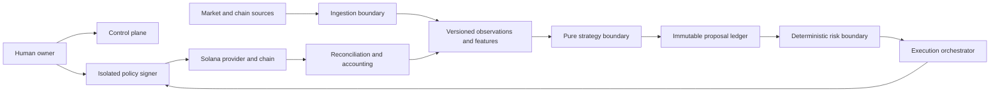

# Architecture context

Only the deterministic risk engine may create an execution authorization. Only the isolated signer
may access future key material. Neither exists as an operational component in Phase 0.
