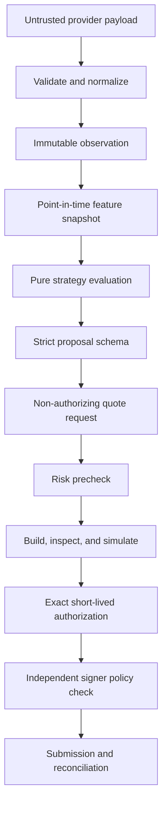

# Data-flow and classification

| Flow               | Classification      | Rule                                              |
| ------------------ | ------------------- | ------------------------------------------------- |
| Provider input     | Untrusted           | Preserve provenance; validate before use          |
| Features/proposals | Integrity-sensitive | Version, hash, append-only evidence               |
| Risk evidence      | Security-critical   | Deterministic, complete rule evidence             |
| Authorization      | Restricted          | Exact binding, nonce, short expiry                |
| Key material       | Secret              | Signer boundary only; never logs/prompts/database |
| Audit events       | Security-critical   | Append-only corrections, durable before live use  |

Phase 0 stops at contracts and synthetic fixtures. The downstream arrows describe future gated work.
