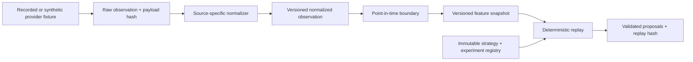

# Phase 1 data foundation

## Determinism rules

- RFC 8785 canonical JSON and SHA-256 define content identity.
- Provider payload hashes are verified before normalization.
- Raw observations deduplicate by source, source identity, and payload hash.
- Observation ordering is source time, source, stable source/observation identity, then hash.
- A replay is bound to experiment hash, strategy-version hash, ordered observation hashes, and seed.
- Point-in-time selection excludes observations after either the timestamp or slot boundary.
- Proposals pass the strict Phase 0 schema and are sorted before their aggregate hash is computed.
- Published definitions and replay outputs are append-only; corrections create new versions/events.

## Persistence ownership

PostgreSQL is authoritative. The initial migration uses exact `numeric` quantities, `jsonb` only for
schema-versioned payloads/evidence, unique content hashes, point-in-time indexes, and mutation-
rejection triggers on published records. TypeScript ports keep database clients out of domain and
strategy packages.

No RPC, provider credential, wallet, signing, or transaction capability is part of this flow.
